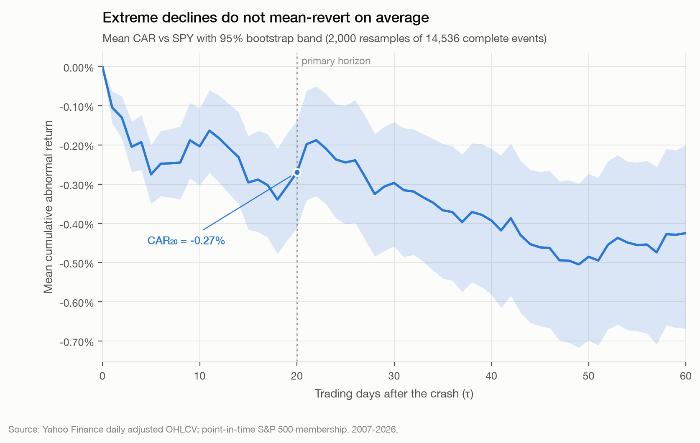
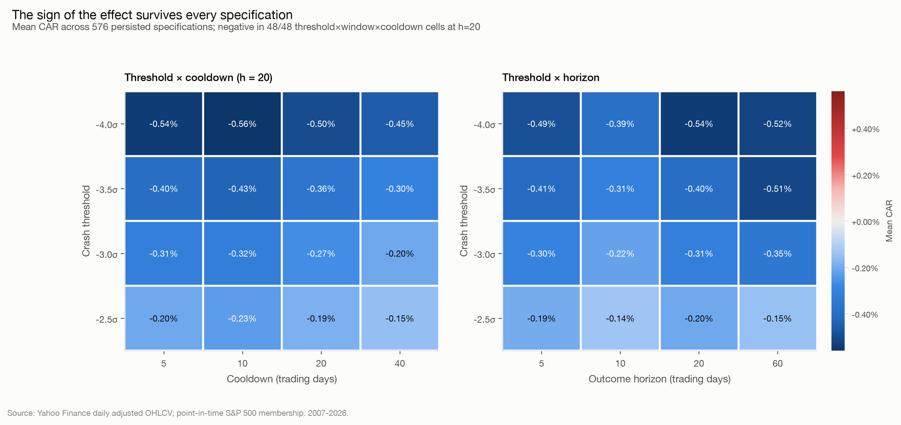
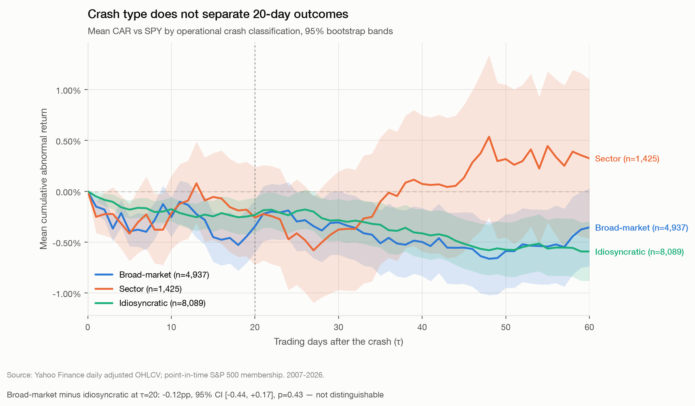
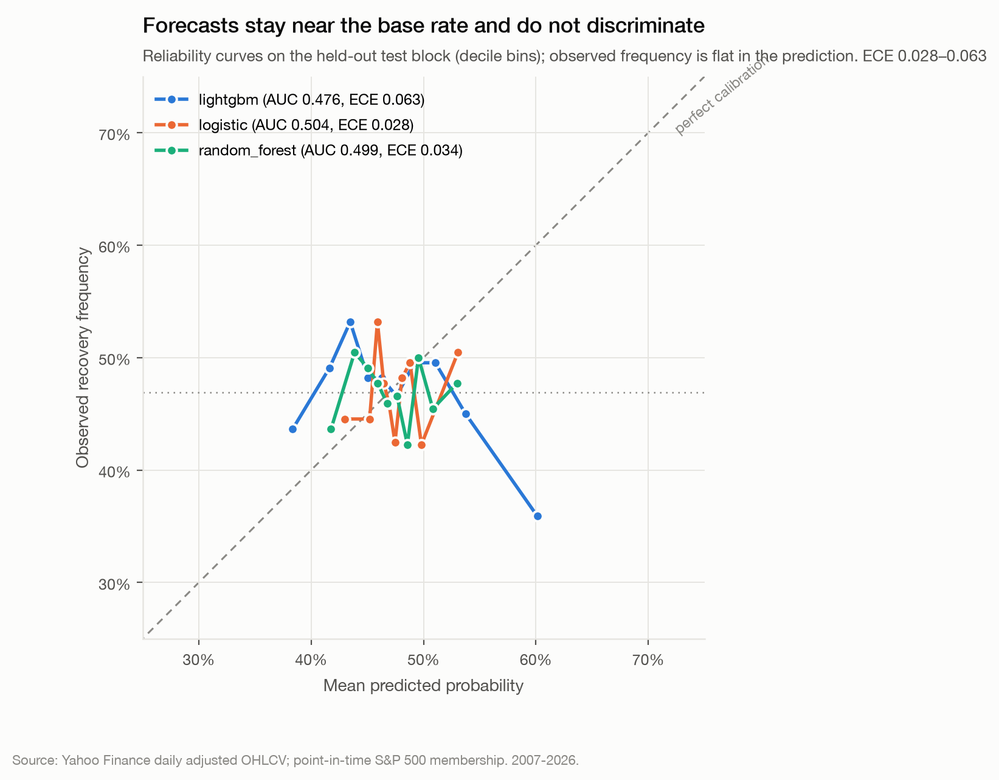
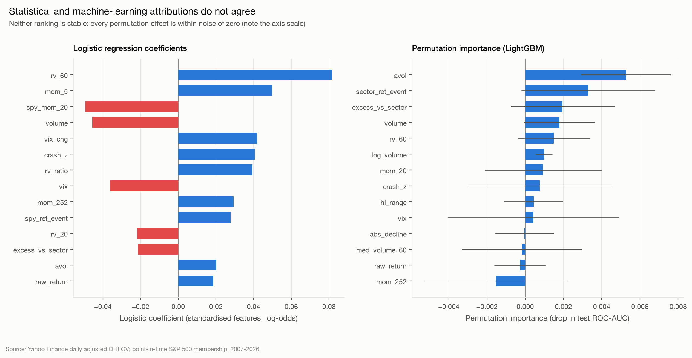

# Dead Cat Detector

**When Extreme Stock Selloffs Reverse—and When They Keep Falling**

Using 14,678 extreme one-day declines among point-in-time S&P 500 constituents
from 2007–2026, this study tests whether severe stock crashes systematically
mean-revert and whether observable event-time features distinguish rebounds from
continued underperformance.

---

## The result

**They do not, on average.**

We estimate a mean 20-day cumulative abnormal return against SPY of
**−0.265%** (95% bootstrap CI **[−0.403%, −0.124%]**, p < 0.001, n = 14,647).
Mean CAR is negative at *every* horizon from 1 to 60 trading days, and the sign
holds in **48 of 48** primary robustness specifications.

The finding has three distinct parts, and conflating them would misread the
evidence:

| | Finding |
|---|---|
| **Universal effect** | No evidence of an average dead-cat bounce. Mean CAR₂₀ = −0.265%; **47.1%** of events end above SPY and only **38.9%** regain their pre-crash close. |
| **Heterogeneity** | Outcomes are *extremely* dispersed. σ(CAR₂₀) = **8.4%** against a −0.27% mean — dispersion is roughly thirty times the central tendency. |
| **Predictability** | The studied features fail to sort those outcomes out-of-sample. Test ROC-AUC 0.476–0.504 against a 0.500 baseline; all three models have *negative* Brier skill. |

The economically interesting problem is therefore **heterogeneity, not a
universal bounce**. The average effect is modestly negative; the variation
around it is enormous; and nothing in the event-time feature set reliably
predicts which side of that distribution a given crash lands on.

> **This is not a trading signal.** No transaction costs, borrow costs, or
> capacity constraints are modelled. A −0.27% mean inside an 8.4% standard
> deviation is a statistical displacement, not an edge.



*Mean cumulative abnormal return against SPY from the event close through 60
trading days, with a 95% bootstrap band from 2,000 whole-event resamples. The
path drifts below zero and stays there.*

### The result does not depend on how the crash is defined



Across **576 persisted specifications** — crash threshold × volatility window ×
cooldown × outcome horizon × high-VIX definition — mean CAR₂₀ is negative in
**48/48** threshold × window × cooldown cells and recovery sits below 50% in
**48/48**. No specification produces a positive and statistically significant
mean. Severity makes the drift worse rather than better: −0.19% at −2.5σ falling
to −0.49% at −4.0σ.

## Event definition

$$z_{i,t} = \frac{r_{i,t} - \mu^{60}_{i,t-1}}{\sigma^{60}_{i,t-1}} \le -3.0$$

μ and σ use the 60 trading days **strictly preceding** *t*. This is enforced by a
test that mutates every return from *t* onward and asserts μ and σ at *t* are
unchanged — if any future information reached the crash definition, that test
would fail.

A **20-trading-day ticker-specific cooldown** collapses each episode to its first
day, so consecutive breaches are not counted as independent observations
(verified minimum gap: exactly 20 trading days, zero violations).

This yields **14,678 events** across 600 tickers, median −3.75σ / −5.4%.
Outcomes are measured **from the event close**, so the crash-day move itself is
excluded from the outcome:

$$CAR_{i,t,h} = R_{i,t:t+h} - R_{SPY,t:t+h}$$

Primary outcome `CAR_20`; primary classification target
`recovered_20d = 1[CAR₂₀ > 0]`. Twenty-one features, all observable at the event
close.

## Data and the point-in-time universe

Daily split- and dividend-adjusted OHLCV from Yahoo Finance via `yfinance`;
index membership from Wikipedia. Study window **2007-01-01 → 2026-08-31**
(19.7 years), with history from 2005-06 for warm-up. Cleaned panel: **2,976,172
ticker-days, 620 tickers, 5,345 trading dates**.

The universe is the S&P 500 **reconstructed point in time** — 868 membership
windows over 846 tickers, built by rolling the current constituent list backwards
through the recorded add/remove log — so a stock is eligible for event detection
only on dates it actually belonged to the index.

**Survivorship bias is substantially reduced, but not solved.** Point-in-time
membership removes look-ahead in universe *selection*, but historical price
availability remains incomplete: only **35.0%** of historical-only members have
usable price history, because the market-data source does not retain most
delisted names. Current members are **99.4%** covered.

The directional implication deserves care. If the missing historical members
disproportionately include failed and delisted firms — which is likely — then the
surviving sample should be biased *upward*, i.e. against the negative finding
reported here. That makes it unlikely this particular bias created the negative
mean CAR, but its exact magnitude is not identified and this is not proof.

Full documentation: [`data/README.md`](data/README.md).

## Statistical hypotheses

Pre-registered in [`docs/research_plan.md`](docs/research_plan.md) before
estimation. They are reported as written, including the ones that failed.

| | Hypothesis | Result |
|---|---|---|
| **H1** | Extreme declines do not universally mean-revert | **Supported** — mean CAR₂₀ = −0.265%, CI excludes zero |
| **H2** | Broad-market crashes recover differently from idiosyncratic | **Not supported** at 20 days (p = 0.43) |
| **H3** | Abnormal volume contains information | **Suggestive but statistically insufficient** (q = 0.14) |
| **H4** | Pre-crash momentum matters | **Not supported** (clustered p = 0.478) |
| **H5** | Market volatility changes the relationship | **Not supported** (p = 0.57) |

**H2 — crash type.** Broad-market −0.351%, sector −0.241%, idiosyncratic
−0.226%. Every pairwise contrast is small and not statistically distinguishable
(broad − idiosyncratic = −0.12pp, p = 0.43).



**H3 — abnormal volume.** The highest-AVOL quartile beats the lowest by
**+0.43pp** (nominal p = 0.028), and the sign is directionally consistent in
**97.9%** of tested specifications. But it does **not survive FDR correction**
(**q = 0.14**). The honest description is *suggestive but statistically
insufficient* — not that volume predicts recovery.

**H5 — volatility regime.** High- minus low-VIX = +0.11pp, p = 0.57.

## Regression results

OLS with **HC3** standard errors, with **date-clustered** standard errors
reported alongside throughout. Because hundreds of names breach the threshold on
the same market-wide day, observations are cross-sectionally dependent and HC3
alone overstates precision. **Where the two disagree, the date-clustered result
governs the substantive interpretation.**

One predictor survives in the pre-registered specification: **20-day realised
volatility**, coefficient +0.063 (HC3 p = 0.0001, date-clustered p = 0.0011),
standardised coefficient 0.101 — roughly **0.85pp of CAR₂₀ per standard
deviation**. Adjusted R² = **0.0085**. In the logistic model its odds ratio is
**1.082** per standard deviation.

### Nothing survives multiplicity

**0 of 32** exploratory coefficients pass Benjamini–Hochberg correction at
q ≤ 0.05.

This is reported in the body rather than an appendix because it is the single
most important guard in the study. Reading the exploratory models without
correction would have surfaced several nominally significant coefficients at
p < 0.05 — and with 32 tests on a near-null outcome, roughly that many false
positives are expected by construction. Uncorrected exploratory significance
here would have been an artefact of the number of tests, not a finding.

## Prediction experiment

Chronological splits with a **20-trading-day embargo** between blocks. Without
it, the last training event's 20-day outcome window overlaps the validation
period, so its label is partly determined by prices the validation features
already observe. Train through 2021-10-21 (10,189) / validate through 2024-06-24
(2,160) / test (2,199); 99 events discarded to the embargo. Hyper-parameters
were chosen on the validation block only, and the test block was scored once.

| Model | Test AUC | PR-AUC | Brier | Log loss | Brier skill | Accuracy |
|---|---|---|---|---|---|---|
| Logistic | 0.504 | 0.477 | 0.2496 | 0.6924 | −0.002 | 0.524 |
| Random forest | 0.499 | 0.477 | 0.2499 | 0.6930 | −0.004 | 0.516 |
| LightGBM | 0.476 | 0.436 | 0.2564 | 0.7064 | −0.030 | 0.493 |
| *Base rate* | *0.500* | *0.469* | *0.2490* | *0.6912* | *0.000* | *0.531* |

Out-of-sample discrimination is indistinguishable from chance, and all three
models have **negative Brier skill** — they are worse than predicting the
training base rate for every event. The constant base-rate model also has the
**highest accuracy** while making the same prediction every time, which is
precisely why accuracy is reported last.



Calibration is nonetheless good (ECE 0.028–0.063): the models are well-calibrated
but carry no discriminating information. A model can be perfectly honest about
probabilities while knowing nothing about which event is which.

## Why the models failed

The conclusion we draw is narrow and specific:

> The available event-time features do not contain stable out-of-sample
> information for distinguishing recovery from continued underperformance.

Two pieces of evidence support reading this as absence of signal rather than
mis-specification.

First, the three interpretation methods **disagree with each other**. Logistic
coefficients, permutation importance, and SHAP each rank a different feature
first.



Disagreement among interpretation methods, combined with chance-level predictive
performance, is consistent with unstable feature ranking driven by noise rather
than with reliable signal that the models merely failed to exploit. SHAP
rankings extracted from a model with 0.476 test AUC should **not** be read as
substantive economics — they describe what an uninformative model happened to
fit in-sample. This is a methodological caution worth stating plainly: an
interpretability plot is only as meaningful as the predictive performance of the
model beneath it.

Second, the near-null is corroborated by the regression and multiple-testing
results, which were produced by a completely different estimation path and reach
the same place.

## Data-quality audit

Two screens run before any analysis, both dropping **whole tickers** rather than
winsorising individual returns. The reason is identity: when a ticker's historical
price series is structurally inconsistent or represents more than one security,
winsorising extreme event returns does not repair the underlying problem — it
launders it into plausible-looking numbers.

**54 rejections total, each manually inspected.** The exclusion log is persisted
to `data/processed/reuse_rejects.parquet` and
`data/processed/integrity_rejects.parquet`.

* **Ticker-reuse guard — 43 dropped.** The downloaded feed serves a *different*
  company under a recycled symbol. `SBNY` returns a listing beginning 17 months
  after Signature Bank failed; the history does not overlap the symbol's recorded
  index membership at all.
* **Price-integrity screen — 11 dropped.** `TIE`'s feed interleaves economically
  incompatible price series under one symbol, alternating day to day between
  ~$14 and ~$8,000. `COL` shows quantised prices of $0.20–$0.85, inconsistent
  with Rockwell Collins's known historical trading range of $60–$140.

### Why this section exists

**Before screening, mean CAR₂₀ computed to +77.7% with σ ≈ 58.** That number is
**not a research result** — it is a data-quality failure discovered during audit.
Six corrupt events on two tickers were overwhelming fourteen thousand real ones.
Had the pipeline reported it without inspecting the underlying series, the study
would have announced a spectacular dead-cat bounce that does not exist.

### The NVDA false positive

An early version of the integrity screen used an absolute price-level rule and
**incorrectly flagged legitimate NVDA history**. NVDA's split-adjusted median
close over the window is $0.80 — entirely genuine, and a consequence of split
adjustment and two decades of price-scale change, not corruption.

The lesson generalises: absolute price thresholds are unsafe in adjusted price
data because splits, historical scale changes, and genuine high-growth
securities all produce legitimately tiny early prices. The corrected rules test
**internal time-series consistency** instead — round-trip level discontinuities,
extreme-move frequency, and value diversity — none of which depend on where a
price sits in absolute terms. The screen is documented in
[`data/README.md`](data/README.md).

## Robustness

**576 specifications persisted** to `results/tables/robustness_grid.csv`. The
robustness figure above is built from the complete grid, not a favourable
subset. Summary: mean CAR₂₀ negative in 48/48 threshold × window × cooldown
specifications; recovery below 50% in 48/48; zero specifications with a positive
and statistically significant mean; AVOL sign consistent in 97.9%.

## Limitations

1. Only 35% of historical-only index members have price data — residual
   survivorship bias, plausibly biasing mean CAR upward, i.e. against the
   reported finding.
2. No delisting returns: removed stocks stop contributing rather than realising
   a terminal value.
3. `CAR` is market-adjusted, not risk-adjusted — a volatility factor could
   absorb the one surviving coefficient.
4. Close-to-close only; a −30% intraday move that closes flat is not an event.
5. **Statistical significance is not economic significance.**
6. Wikipedia membership records are crowd-edited and unreliable before 2007,
   which is why the window starts there.
7. The data source restates adjusted history, so exact reproduction requires the
   same download date; the manifest records it.
8. Large-cap US equity, 2007–2026 only. Conclusions hold within this design and
   do not extend automatically to other markets, capitalisations, or eras.
9. A near-null is not proof of no effect. Fundamentals, news text,
   options-implied data and order flow are unexamined, and any of them could
   carry information these features do not.

## Reproduction

```bash
git clone https://github.com/Gariyuuu/dead-cat-detector && cd dead-cat-detector
make setup      # uv venv (Python 3.12) + dependencies
```

Three entry points, cheapest first:

```bash
make verify     # check all 38 documented claims against persisted results
make test       # 43 tests, no data download required
make analysis   # rebuild every analysis stage from cached data
make all        # full pipeline including the data download
```

`make verify` and `make test` run against what is committed and need no network
access. `make all` re-downloads prices and takes roughly 20 minutes end to end,
dominated by the download and the robustness grid.

All randomness is seeded (`20260902`), and the config fingerprint
`a9ca33aed3d9` is stamped into every persisted result.

**macOS note:** LightGBM requires OpenMP — `brew install libomp`.

## Tests

**43 tests**, concentrated on the leakage surface rather than on line coverage.

The load-bearing one is a **causality test on feature timing**: it mutates every
return from the event date *t* onward and asserts that the rolling mean and
volatility used to define the crash at *t* are bit-for-bit unchanged. A
conventional test that merely recomputes the window can pass while silently
using future data; this one cannot. It is the test that would catch the single
most damaging error this design can make.

The suite also covers forward-return indexing, benchmark alignment, cooldown
enforcement, event uniqueness, point-in-time membership gating, the ticker-reuse
guard, the integrity screen, chronological splitting and the 20-day embargo, the
feature matrix excluding all outcome columns, and seed determinism across all
three model families.

## Repository structure

```text
dead-cat-detector/
├── README.md               ← you are here
├── Makefile                 reproduction pipeline
├── pyproject.toml
├── configs/default.yaml     every parameter of the primary specification
├── data/README.md           sources, fields, screens, licensing, limitations
├── notebooks/               01 data audit → 05 robustness
├── src/deadcat/
│   ├── config.py            config loading, overrides, fingerprinting
│   ├── data.py              universe reconstruction, download, quality screens
│   ├── events.py            crash detection, cooldown, forward outcomes
│   ├── features.py          event-time features, crash-type classification
│   ├── statistics.py        bootstrap, HC3 + clustered OLS, logit, BH-FDR
│   ├── models.py            embargoed chronological splits, model builders
│   ├── evaluation.py        probabilistic metrics, calibration, SHAP
│   ├── plotting.py          validated palette and figure builders
│   └── pipeline.py          shared panel loader
├── scripts/                 01_build_dataset → 07_figures, verify_claims
├── tests/                   43 tests, leakage-focused
├── results/{figures,tables,metrics}/
├── docs/
│   ├── research_plan.md     pre-registration
│   └── data_leakage_audit.md
└── report/report.md         full research report
```

## Licence

MIT (code). Price data is retrieved from Yahoo Finance for non-commercial
research and is **not** redistributed here — only the code that reproduces it.
